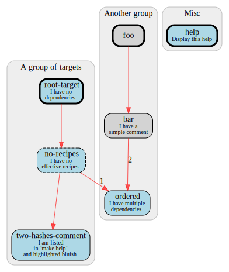

# makefile2dot

Reads a Makefile from stdin, generates a graph in GraphViz format and prints it to stdout.

Pipe the output to `dot` to generate an actual image.

Example call:
```bash
./makefile2dot.sh <Makefile 3 0.0 spline | dot -Tsvg >Makefile.svg
#                           | |   |
#                           | |   spline|polyline|ortho|curved|line
#                           | ranksep
#                           words/line
```

Usage: `./makefile2dot.sh WORDS_PER_LINE RANKSEP SPLINES`
- `WORDS_PER_LINE`: number of words per line in comments; examples: `2`, `3`, `6`
- `RANKSEP`: see [GraphViz doc](https://www.graphviz.org/doc/info/attrs.html#d:ranksep); examples: `0`, `0.5`, `1`, `2`
- `SPLINES`: see [GraphViz doc](https://www.graphviz.org/doc/info/attrs.html#d:splines); examples: `spline`, `polyline`, `ortho`, `curved`, `line`

Supporting:
- Target groups: `##@ My group header`
- Highlighted targets: `my-taget:  ## Double-hash to highlight`

## Example



The [example Makefile](example/Makefile) features auto-generated help messages [1].

```bash
$ make help
Usage:
  make <target>

A group of targets
  root-target           I have no dependencies
  no-recipes            I have no effective recipes
  two-hashes-comment    I am listed in `make help` and highlighted bluish

Another group
  ordered               I have multiple dependencies

Misc
  help                  Display this help
```

[1] https://suva.sh/posts/well-documented-makefiles/
    (replace `[a-zA-Z_-]` with `[^\t #]`)
